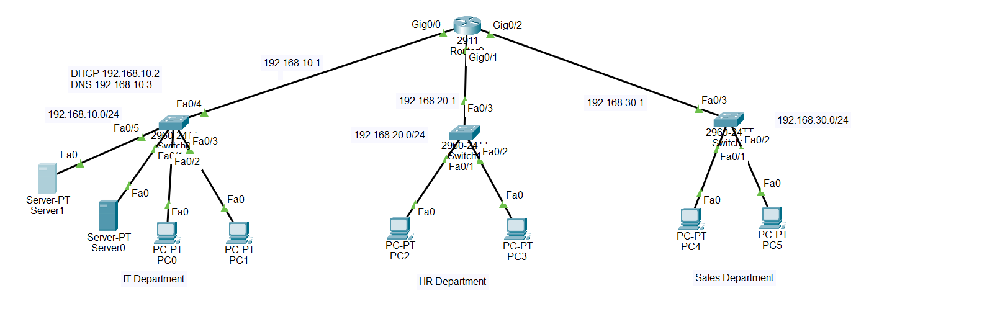
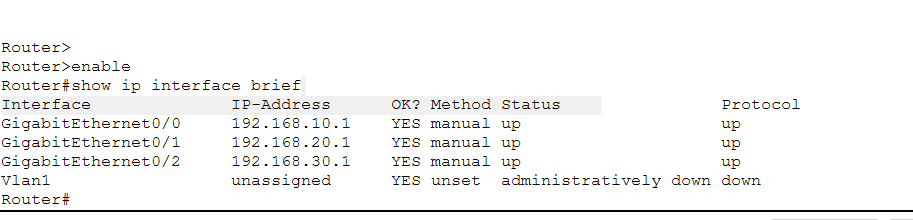
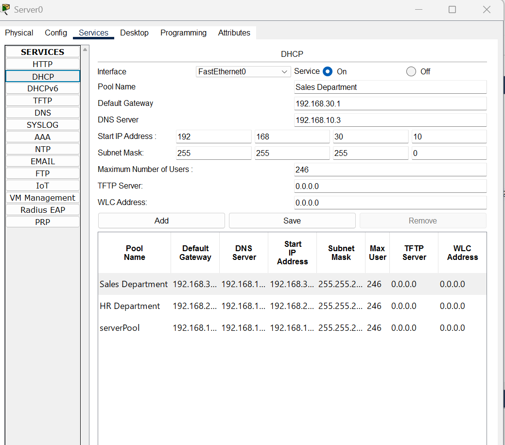
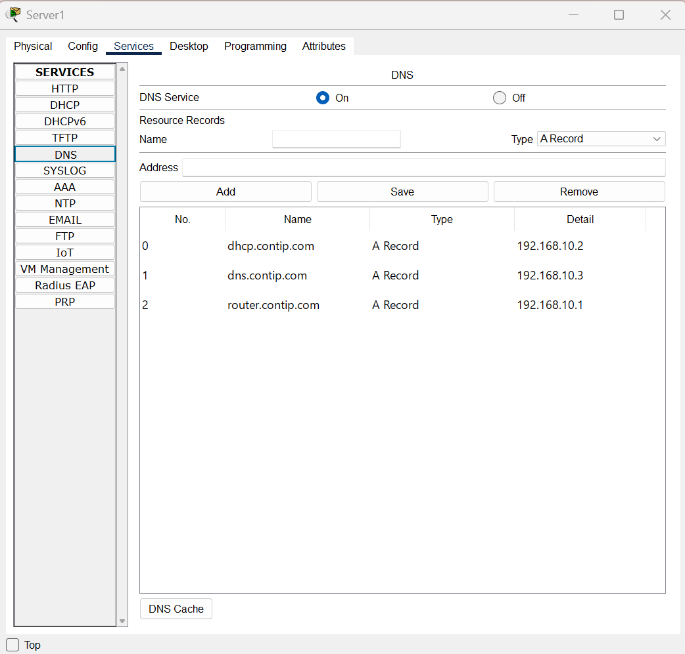
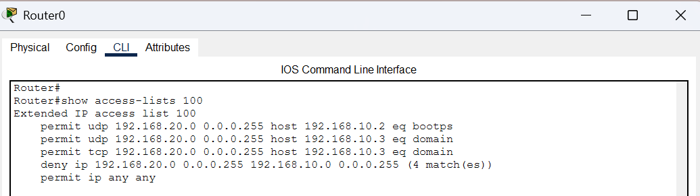
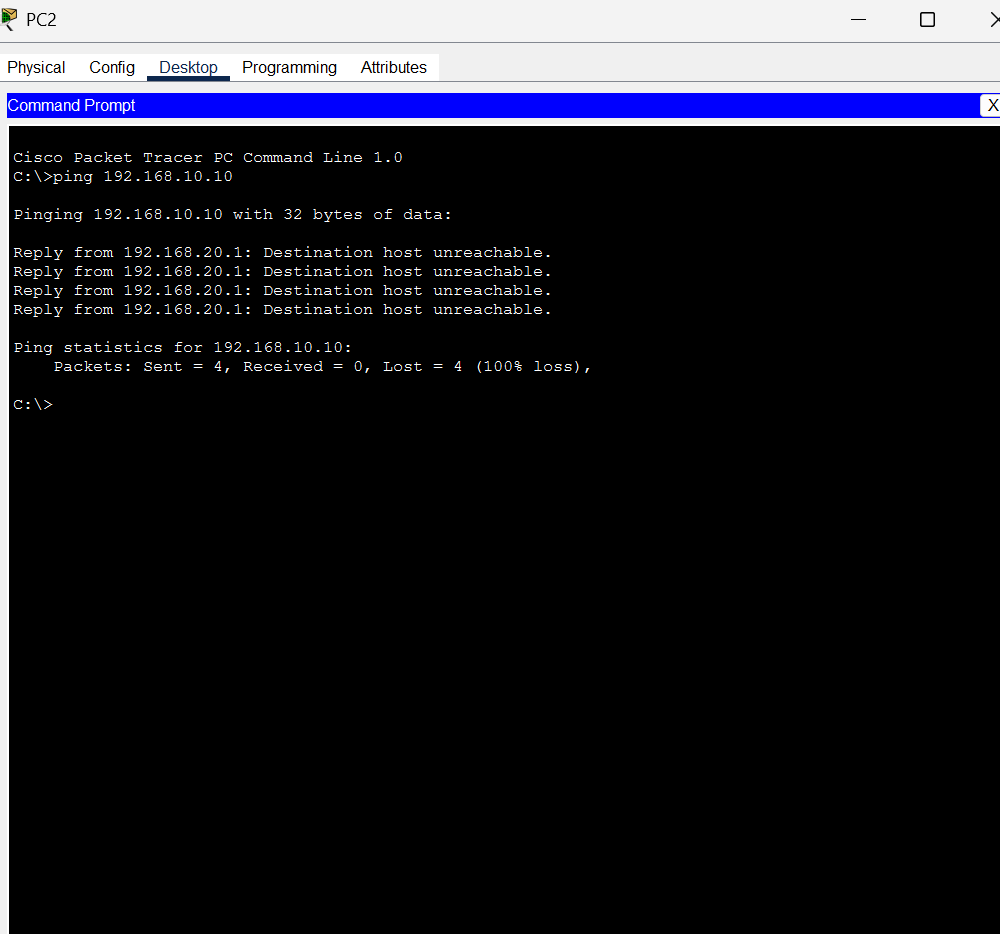
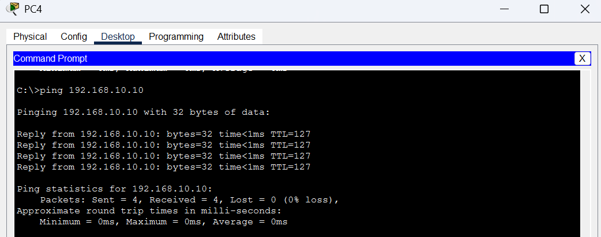
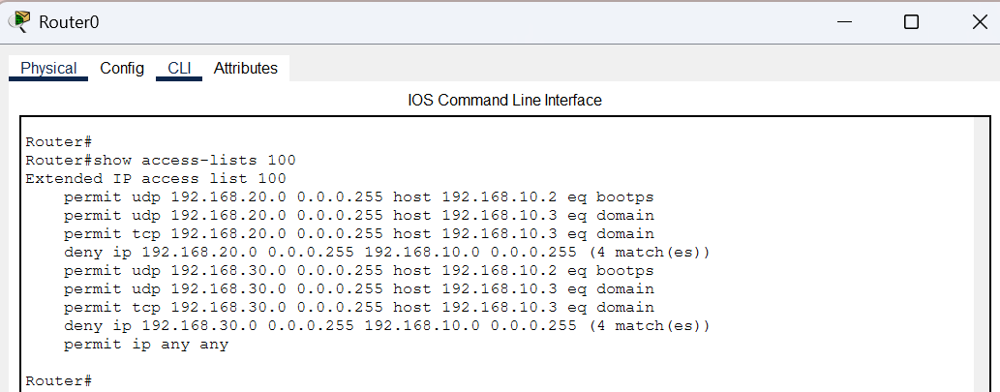
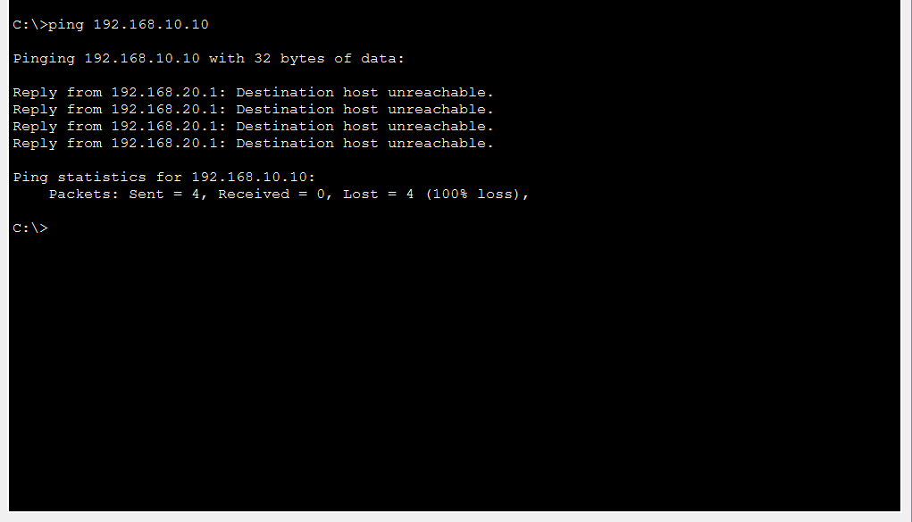

# Contip Network Segmentation and Access Control Lab

## Project Overview

This project demonstrates the design and implementation of a segmented enterprise network using Cisco Packet Tracer.

The network consists of three departments:

- IT
- HR
- Sales

Each department operates on a separate subnet, while centralized DHCP and DNS services are hosted within the IT network.

The project uses extended Access Control Lists (ACLs), DHCP relay, DNS, subnetting, and inter-network routing to control communication between departments.

## Case Study

Contip is a fictional organization with three departments: IT, HR, and Sales.

The company requires each department to operate on a separate network while sharing centralized infrastructure services such as DHCP and DNS.

The initial business requirement was to restrict HR from accessing IT resources while allowing Sales to communicate with the IT department. HR still needed access to essential services such as DHCP and DNS.

After implementing the original requirement, a second security scenario was introduced to demonstrate a stronger least-privilege approach.
### Scenario 1 - Original Business Requirement

- HR is restricted from accessing IT resources.
- HR is allowed to use the centralized DHCP and DNS services.
- Sales is allowed to communicate with the IT network.

### Scenario 2 - Enhanced Network Segmentation

- HR is restricted from accessing IT resources.
- Sales is also restricted from accessing IT resources.
- Both HR and Sales retain access to approved DHCP and DNS services.

This second scenario demonstrates how ACLs can be modified to enforce tighter network segmentation without disrupting essential infrastructure services.
## Network Topology

The lab uses three separate /24 networks for the IT, HR, and Sales departments. A Cisco 2911 router provides inter-network routing between the three networks.

## IP Addressing Scheme

| Department / Service | Network / IP Address | Purpose |
|---|---|---|
| IT Network | 192.168.10.0/24 | IT department and shared services |
| IT Gateway | 192.168.10.1 | Router G0/0 |
| DHCP Server | 192.168.10.2 | Centralized DHCP service |
| DNS Server | 192.168.10.3 | Centralized DNS service |
| HR Network | 192.168.20.0/24 | HR department |
| HR Gateway | 192.168.20.1 | Router G0/1 |
| Sales Network | 192.168.30.0/24 | Sales department |
| Sales Gateway | 192.168.30.1 | Router G0/2 |

## Router Configuration

The router provides Layer 3 connectivity between the three departmental networks.

DHCP relay is configured on the HR and Sales interfaces using `ip helper-address 192.168.10.2`, allowing clients on remote subnets to obtain addresses from the centralized DHCP server.

The clean base router configuration is available here:

[View Router Base Configuration](configurations/router-base-config.txt)

## DHCP Configuration

A centralized DHCP server at `192.168.10.2` provides addressing for the IT, HR, and Sales networks.

Each DHCP scope provides the appropriate default gateway and assigns `192.168.10.3` as the DNS server.

## DNS Configuration

The DNS server is hosted at `192.168.10.3`.

The following A records were created:

| DNS Record | IP Address |
|---|---|
| dhcp.contip.com | 192.168.10.2 |
| dns.contip.com | 192.168.10.3 |
| router.contip.com | 192.168.10.1 |

## Scenario 1 - Original Business Requirement

The first security policy restricts HR from accessing the IT network while allowing access to required DHCP and DNS services.

Sales is allowed to communicate with the IT network.

### Scenario 1 ACL Logic

- Permit HR to DHCP using UDP port 67
- Permit HR to DNS using UDP port 53
- Permit HR to DNS using TCP port 53
- Deny all other HR traffic to the IT subnet
- Permit all remaining traffic

The complete ACL configuration is available here:

[View Scenario 1 ACL](configurations/scenario-1-acl.txt)

### ACL Verification

### HR to IT Test

HR is unable to reach an IT workstation, confirming that the ACL restriction is working.

### Sales to IT Test

Sales retains access to the IT network as required by the original business policy.

## Scenario 2 - Enhanced Network Segmentation

Scenario 2 introduces a stronger least-privilege policy.

Both HR and Sales are prevented from accessing general IT resources while retaining access to centralized DHCP and DNS infrastructure.

### Scenario 2 ACL Logic

- Permit HR to approved DHCP and DNS services
- Deny HR access to other IT resources
- Permit Sales to approved DHCP and DNS services
- Deny Sales access to other IT resources
- Permit remaining traffic

The complete ACL configuration is available here:

[View Scenario 2 ACL](configurations/scenario-2-acl.txt)

### ACL Verification

The ACL match counters confirm that traffic from both HR and Sales matched the corresponding deny statements.

### HR to IT Test

### Sales to IT Test

### DNS Availability Test

Although general access to the IT network is restricted, DNS remains available as an approved infrastructure service.

The HR client successfully resolved `dns.contip.com` using the DNS server at `192.168.10.3`.

## Testing Summary

| Test | Scenario 1 | Scenario 2 |
|---|---|---|
| HR → IT | Blocked | Blocked |
| Sales → IT | Allowed | Blocked |
| HR → DHCP | Allowed | Allowed |
| Sales → DHCP | Allowed | Allowed |
| HR → DNS | Allowed | Allowed |
| Sales → DNS | Allowed | Allowed |

## Packet Tracer Files

The complete Cisco Packet Tracer lab files are available below:

- [Scenario 1 - Sales Allowed](packet-tracer/Contip-Scenario-1-Sales-Allowed.pkt)
- [Scenario 2 - Sales Restricted](packet-tracer/Contip-Scenario-2-Sales-Restricted.pkt)

## Packet Tracer Note

During validation, some TCP DNS ACL entries did not persist consistently after reopening the Packet Tracer `.pkt` files.

The complete intended ACL configurations, including both UDP and TCP port 53 rules, are therefore documented separately in the `configurations` directory.

The project screenshots capture the ACLs during configuration and verification.

## Skills Demonstrated

- Cisco Packet Tracer
- Cisco IOS
- Extended Access Control Lists
- Network Segmentation
- Inter-subnet Routing
- DHCP and DHCP Relay
- DNS
- TCP/UDP Service Filtering
- Subnetting
- ACL Rule Ordering
- Least-Privilege Network Design
- Connectivity Testing
- ACL Match Counter Analysis
- Network Troubleshooting
